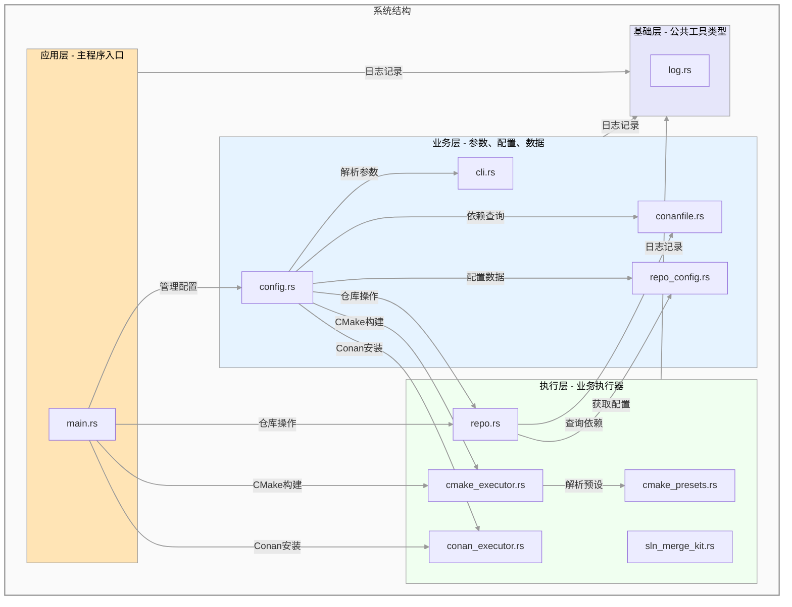

## 工作流程

```plantuml

:先处理参数，写入到Config中;
if (是否传入了参数文件？) then (false)
    :生成默认参数文件;
    end
endif

if (仓库路径是否存在？) then (false)
    :检出仓库;
endif
:收集conan依赖关系;
:根据conan依赖关系计算每个库需要哪些库
（用conan名称记录）;
:进行拓扑排序;
:开始按照拓扑顺序遍历;
repeat
    :获得当前处理的仓库路径;
    if (判断是否需要修改CMakeUserPresets.txt？) then (需要修改)
        :修改CMakeUserPresets.txt;
        :执行CMake配置并指定--fresh;
    endif
    if (获得CMake中包名称和安装位置？) then (获取失败)
        :执行CMake配置;
    else (获取成功)
        :记录到运行时信息中;
    endif
    :执行CMake build;
    if (是否是最终的可执行程序？) then (false)
        :执行CMake install;
    endif
repeat while(遍历已结束？) is (false)
:把需要调试的sln合并到可执行程序的sln中;

```

## 文件依赖关系图



## conan_toolchain.cmake 文件的处理方式

由于很多仓库都在 cmake 内部执行 Conan install ，这个过程不好完全屏蔽（容易造成别人无法编译程序），此外屏蔽它需要修改源码，这与此调试工具非侵入式的设计背道而驰。

处理原则： conan_toolchain.cmake 必须只有一个来源，多个来源会导致很多乱七八糟的错误。

最后采取的解决方法：如果仓库内部 CMake 配置过程中会执行 Conan install，就在仓库配置中启用 `conan_toolchain_managed_by_cmake`（旧键名 `use_cmake_conan_files` 仍可作为别名读取），此工具不会在 CMakeUserPresets.json 中注入 conan_toolchain.cmake 路径（即移除 `CMAKE_TOOLCHAIN_FILE`），确保 toolchain 只有一个来源。CMakeLists.txt 内部执行的 Conan install 通常结果更准确，传参也更完整。
同时仍然允许通过 CLI 控制 conan install 的开关/更新（`--conan`/`--conan-update`），并据此向 CMake 传递“开启/更新/关闭 Conan”的额外参数，提升构建速度并避免 Conan install 失败时构建卡住。
如果原始仓库的设计是在 CMakeLists.txt 中执行 Conan install，那么无论外部传递什么 CMake 参数，原始仓库中的 CMakeLists.txt 都需 include 内部生成的 conan_toolchain.cmake；仅依赖缓存会导致包查询出错。
注意：本工具并不会默认执行 Conan install，只有显式传入 `--conan` 或 `--conan-update` 时才会执行。Conan install 生成的 conan_toolchain.cmake 会计算 hash，用于判断是否需要对 CMake 配置追加 `--fresh`。

### conan_toolchain 与本地联调依赖注入的优先级策略

在多仓联调场景下，`conan_toolchain.cmake` 往往会通过 `list(PREPEND CMAKE_PREFIX_PATH ...)` 把 Conan 路径置于搜索前列。  
这对第三方库是必要的（不能完全移除 toolchain），但会影响本地调试仓库的优先解析顺序。

为兼顾「保留 toolchain 能力」与「强制使用本地构建依赖」，本工具采用以下策略：

1. 保留 `conan_toolchain.cmake` 引入（提供第三方库所需的全局编译/查找环境）。
2. 对需要本地联调的依赖，显式注入 `<PackageName>_DIR` 到 `cacheVariables`。
3. 利用 CMake 查找优先级中 `*_DIR` 对目标包的更高优先级，覆盖 `CMAKE_PREFIX_PATH` 的默认查找结果。

该策略属于非侵入式方案：不修改业务仓库源码、不篡改 Conan 生成文件，仅在调试工具注入层完成可控覆盖。  
注意此策略依赖包名与 `find_package()` 名称匹配；若名称不一致，需要在配置中维护映射或统一命名约定。

## Conan install 旧包与 CMake 构建新包的一致性问题

### 现象

本地多仓联调时，Conan install 阶段与 CMake 构建阶段使用的是不同来源的包信息：

- **Conan install 阶段**：解析的是本地缓存中的包 recipe（包的元数据 / 依赖图），通常是旧版本；
- **CMake 构建阶段**：编译的是本地工作区刚修改的源码，是新的。

### 根因

Conan 依赖解析（install）与实际源码构建（CMake build）是两条独立的通道：
当底层库的 `conanfile.py` 发生变化——尤其是**增加或修改一条 conan 包依赖**时，
conan 缓存中的旧 recipe 并不会随之更新，上层仓库 install 时仍按旧 recipe 展开依赖图，
新增/变更的依赖不会进入上层的依赖解析结果。

修改源码（内容变化）不影响依赖图，因此无碍；
但修改 `requires`（依赖关系变化）会使 Conan 的 recipe 图与本地源码图脱节，
且 `--update` 只向远端查询新版本，无法覆盖本地缓存中的旧 recipe。

### 后果

- 新依赖不会出现在上层 conan 生成物（如 `conan_toolchain.cmake` 的查找路径）中；
- 严重时导致 CMake 配置错误（`find_package` 找不到新依赖）或运行时错误（依赖版本/接口不匹配、缺少运行库）。

## Ctrl-C 中断及进程残留问题处理方案

在执行诸如 `cmake`、`msbuild` 或 `cl.exe` 等长时间执行的构建命令时，如果在控制台中按下 `Ctrl-C`，会导致进程中断。
最初尝试使用 `command-group` 库来保证整个进程组的退出。然而实践证明在 Windows 下效果不佳 —— 当主控进程率先响应默认中断事件而退出时，底层的 `cl.exe` 或 `msbuild` 子进程极易产生遗漏隔离，变成孤儿残留进程。这也使得手写复杂的拦截信号与主动清理子进程变得非常困难且容易出现竞态。

更好的解决方案是使用系统底层的 Job Object 机制（位于分离出的 `job-guard` 模块中）。通过在 `main()` 启动入口调用 `AssignProcessToJobObject` 将当前 `multi_repo_debug_tool` 绑定到一个设定了 `JOB_OBJECT_LIMIT_KILL_ON_JOB_CLOSE` 的全局作业对象（Job Object）中去。
这样，不论是因为 `Ctrl-C` 强行终止、还是常规程序报错退出、乃至发生严重崩溃销毁，系统内核均会在此包含主进程的全局任务句柄由于进程消亡而被关闭时，底层级、无条件、强制地整体清退属于该 Job 的**所有**衍生子进程群体（无视跨域与状态）。一劳永逸、稳定可靠，并在上层无需去干预和重构标准库阻塞进程（`.spawn()` 和 `.status()`）的调用形式。
